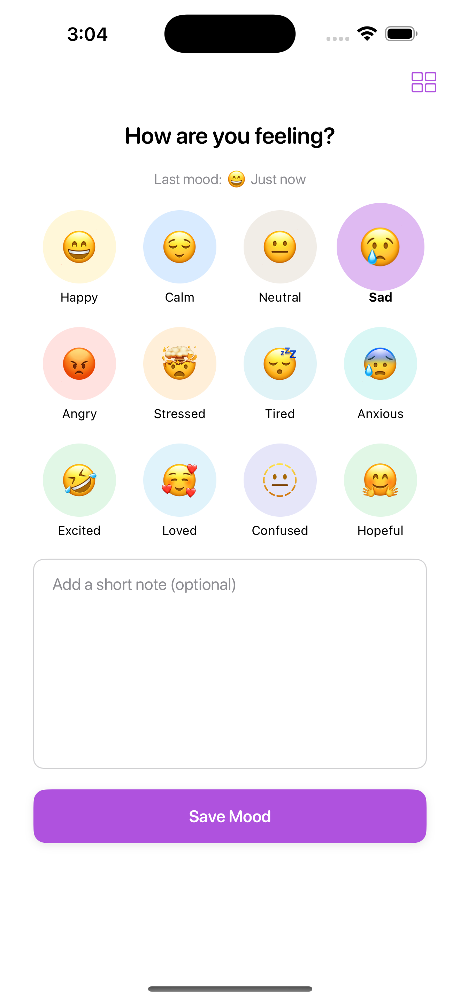
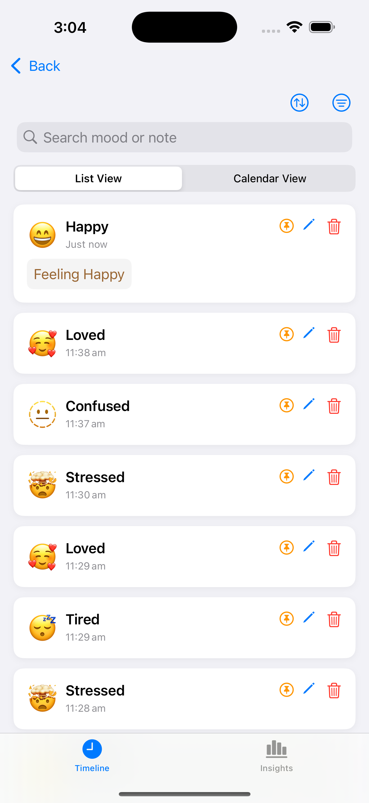
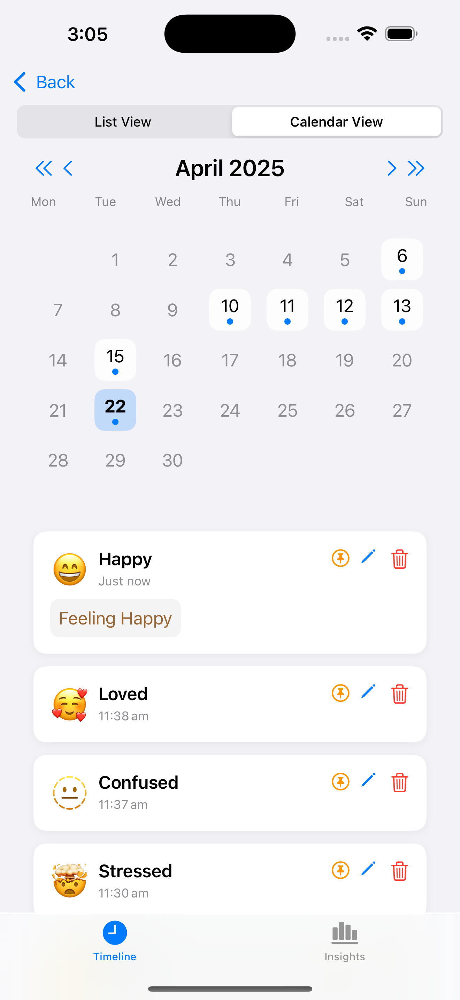
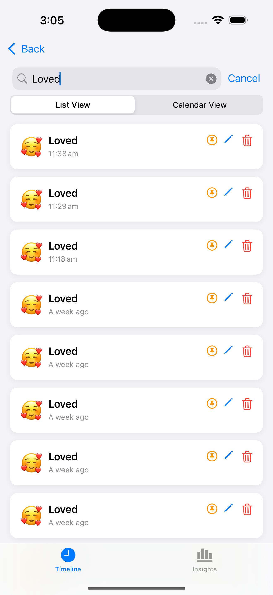
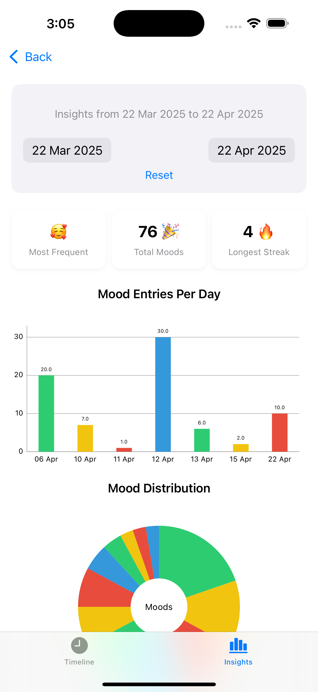

# 🌈 MyMoodz

**MyMoodz** is a SwiftUI-based mobile mood tracking app that helps users become more mindful of their emotional well-being. Track your feelings, view past entries, and gain beautiful insights—all from your iPhone.

---

## ✨ Features

- 🎭 **Quick Mood Logging**: Select from 12 expressive emoji moods like Happy, Sad, Angry, and more.
- 📝 **Add Notes**: Optionally write a short reflection when saving a mood.
- 📋 **Timeline View**: Browse all mood logs in a searchable, scrollable list.
- 🗓️ **Calendar View**: Tap into any day to view past entries on a calendar grid.
- 🧠 **Insights Dashboard**:
  - Most frequent mood
  - Total mood entries
  - Longest streak
  - Mood entries per day
  - Mood distribution by weekday and over time
- ✏️ **Edit/Delete Moods**: Update or remove logs whenever you like.
- 📌 **Pin Moods**: Mark important moments to revisit them easily.
- 🔍 **Search & Sort**: Filter by keyword, emoji, or timeframe.

---

## 📱 Screenshots

### Mood Entry Screen

Log a mood with one tap and optionally add a note  


### Timeline View

See your complete log of moods, with edit and delete options  


### Calendar View

Quickly visualize which days you logged your moods  


### Search and Sort

Filter moods by time, name, emoji, and edit state  


### Mood Insights

See mood trends, frequencies, and emotional patterns  


---

## 🧑‍💻 Tech Stack

- **Language**: Swift 5
- **UI Framework**: SwiftUI
- **Local Storage**: Core Data
- **Charts & Visuals**: Custom SwiftUI charts + DG Chats
- **Architecture**: MVVM
- **Build Schemes**:
  - `[DEV]`: For development/testing
  - `[PROD]`: Production-ready configuration

---

## ⚙️ Installation & Running Locally

> 💡 This app is designed *exclusively for iOS* and does not support other platforms.

### Prerequisites

- macOS with latest Xcode installed (Xcode 13+)
- iPhone or iOS Simulator
- CocoaPods or Swift Package Manager (if using third-party chart libraries)

### Steps

1. **Clone the Repository**

   ```bash
   git clone https://github.com/yourusername/MyMoodz.git
   cd MyMoodz
   ```

2. **Open in Xcode**
   - Open `MyMoodz.xcodeproj` or `MyMoodz.xcworkspace`.

3. **Choose a Scheme**
   - In the toolbar, select either `[DEV]` or `[PROD]` schema based on your need.

4. **Run the App**
   - Select a device or simulator.
   - Hit the **Run (▶️)** button.

---

## 👇 How to Use

1. **Log Your Mood**
   - Tap a mood emoji.
   - Add a note if desired.
   - Tap **Save Mood**.

2. **View and Manage Entries**
   - Navigate to the **Timeline** or **Calendar**.
   - Use the ✏️ or 🗑️ to edit/delete.
   - Use filters to refine your view.

3. **Check Your Insights**
   - Tap the **Insights** tab to view emotional trends and graphs.

---

## 🚧 Future Roadmap

- 🔔 Mood tracking reminders
- 🧩 Custom mood creation
- 🌚 Dark mode support
- 🚫 *No* iCloud or sync planned (data stays local for privacy)

---

## 👤 Author

Built with 💛 using SwiftUI by **[Your Name]**

> For questions, feature ideas, or contributions, feel free to reach out or open an issue!
