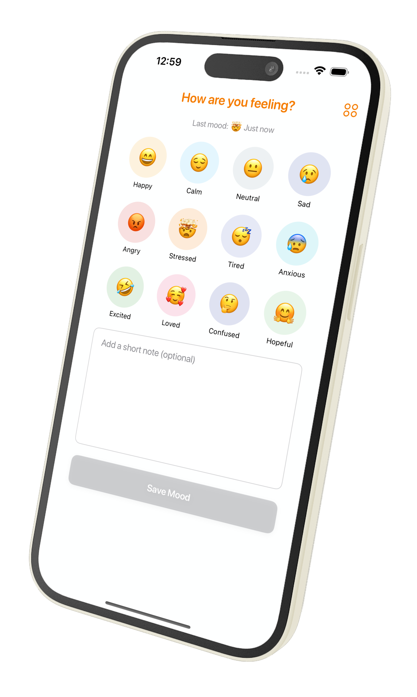
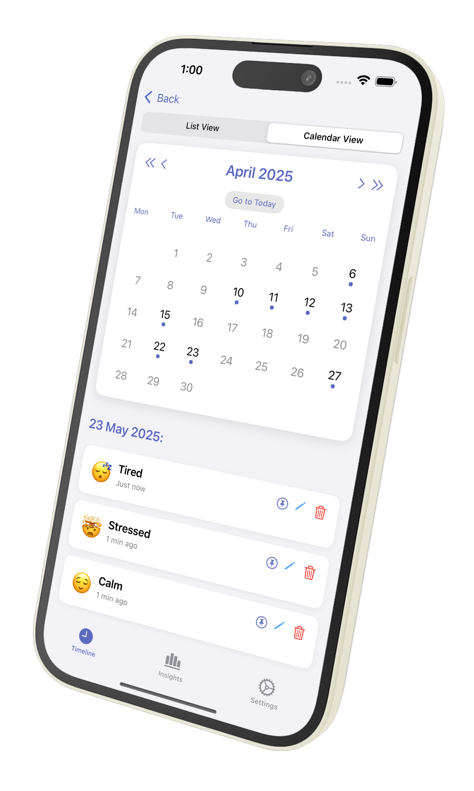

# MyMoodz

**MyMoodz** is a fully open-source, privacy-first mood tracker available on both **Android** and **iOS**. Easily log your moods with emojis, view trends over time, and reflect — all without accounts, ads, or cloud storage.

---

## 📱 Platforms

- **Android** – `/android`
- **iOS** – `/iOS`

---

## 🚀 Features

- Emoji-based mood logging
- Optional notes
- Timeline (list/calendar view)
- Mood statistics & insights
- Dark mode support
- 100% offline

---

## 📂 Project Structure

```
MyMoodz/
├── android/        # Android source code
├── iOS/            # iOS source code
├── docs/           # Project documentation
├── .gitignore
└── README.md
```

---

## 🛠 Setup Instructions

### iOS

```bash
cd iOS
open MyMoodz.xcodeproj
```

- Use Xcode to build & run.
- Ensure provisioning profiles are set up for your dev account.

### Android

```bash
cd android
./gradlew assembleDebug
```

- Requires Android Studio or compatible CLI environment.

---

## 🧾 Documentation

Find implementation details, UI flow, and component structure in the [`docs/`](./docs) folder.

> To contribute, see [docs/contributing.md](./docs/contributing.md) _(coming soon)_

---

## 💖 Why MyMoodz?

- Free forever
- No ads or logins
- Cross-platform
- Built and maintained by a solo developer 🙌

---

## 📸 Screenshots

<p align="center">
  
  
  
  
</p>

---

## 📄 License

MIT – see [LICENSE](./LICENSE) for details.
